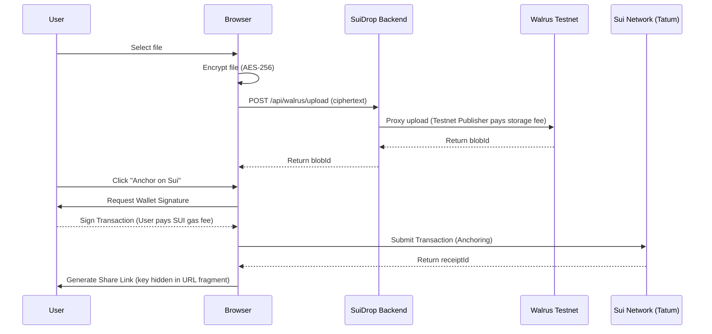
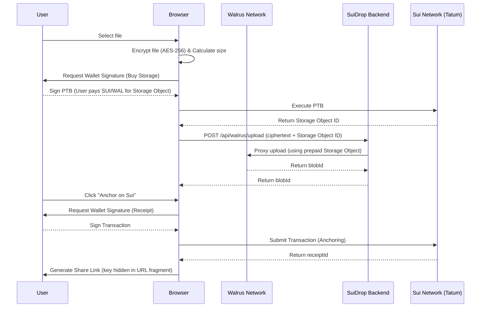
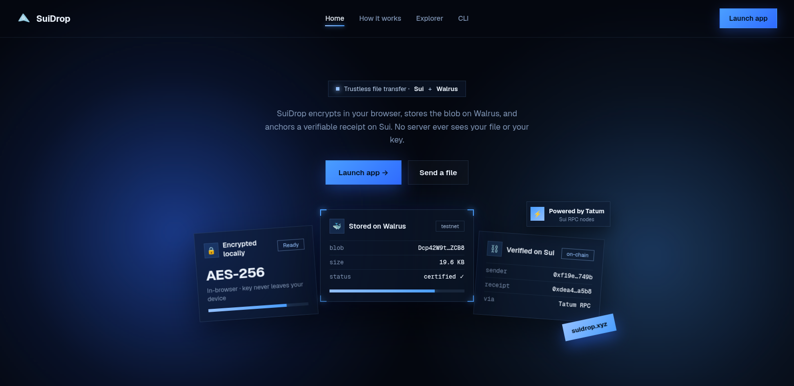
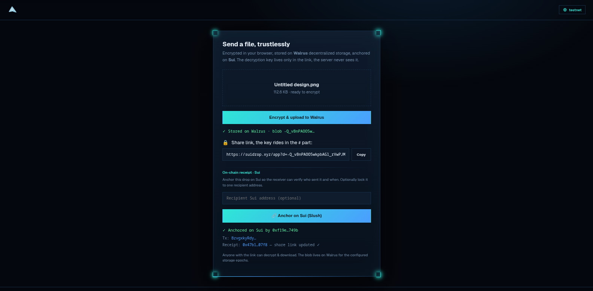
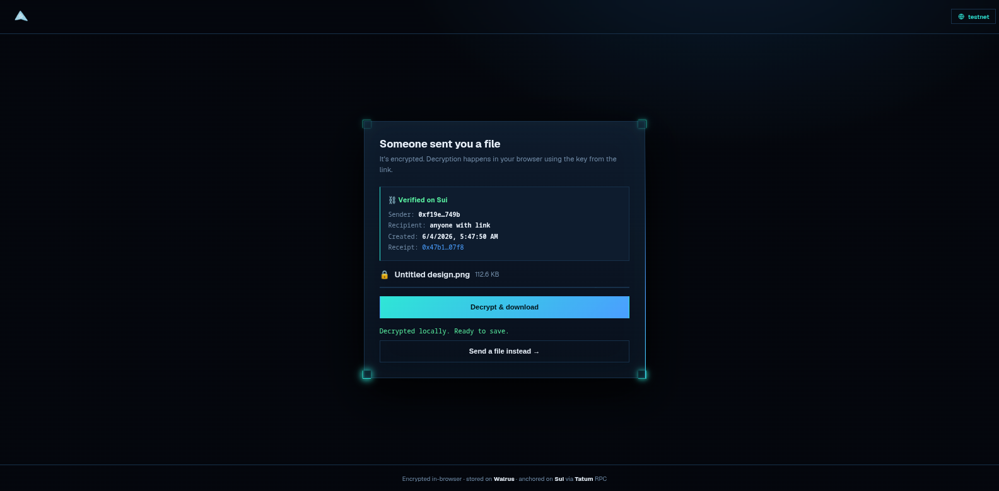

# SuiDrop

Trustless, end to end encrypted file transfer on Sui and Walrus.

SuiDrop encrypts your file in the browser, stores the ciphertext on Walrus decentralized storage, and anchors a verifiable receipt on Sui. The decryption key never leaves the share link, so the server never sees your file or your key.

Built for the Tatum x Build on Sui with Walrus hackathon.

- Live app: https://suidrop.xyz
- Network: Sui Testnet
- Move package: `0x113d58b1ee1b369eb0beaa3e8b9af52f1e19b0ba7758a8972c51508e5bac0ce9`
- Package on SuiVision: https://testnet.suivision.xyz/package/0x113d58b1ee1b369eb0beaa3e8b9af52f1e19b0ba7758a8972c51508e5bac0ce9

## Architecture Workflow



### Architecture Workflow (in SuiDrop Mainnet)



## Screenshots







## How it works

1. Encrypt locally. The file is encrypted with AES-256-GCM using the Web Crypto API in the browser. The key is generated client side and never sent to the server.
2. Store on Walrus. The ciphertext is uploaded to Walrus and returns a blob id.
3. Anchor on Sui. The sender's wallet signs a Move call that mints a `DropReceipt` object recording the blob id, sender, recipient, size, a hash of the filename, and the time.
4. Share a link. The link has the shape `/(app)?d=<blobId>&r=<receiptId>#<key>`. The key lives only in the URL fragment, which browsers never send to servers.
5. Receive. The recipient's browser verifies the receipt on Sui through Tatum RPC, fetches the blob from Walrus, and decrypts it locally.

## Why Walrus and Tatum

- Walrus holds the actual file. The encrypted blob is the product, not a side feature. Sui holds the small receipt that links to it.
- Tatum is the read path to Sui. Receipt verification on the receive page and the explorer both call Sui JSON-RPC through Tatum nodes. Calls are proxied server side so the API key stays secret, and they are rate limited to stay inside the free tier.

## Privacy

- The decryption key is in the URL fragment only. It is never sent to the backend.
- Only a SHA-256 hash of the filename is stored on chain, never the plaintext name.
- The backend only relays encrypted bytes it cannot read.

## Explorer

The Explorer reads `DropCreated` events from Sui through Tatum RPC and aggregates the total number of drops, files sent, and total size stored on the protocol, plus a live feed. There is no separate indexer or database. Sui is the index.

## Architecture

```
Browser (plain HTML + Web Crypto)
  encrypt and decrypt locally, key stays in the URL fragment
        |
        v
Rust backend (axum)
  hides the Tatum API key
  throttles Sui RPC to the free tier limit
  proxies Walrus publisher and aggregator
  serves the landing page and the app
        |
        +--> Walrus  (store and fetch the encrypted blob)
        +--> Sui via Tatum RPC  (mint receipt, verify, explorer events)
```

## Tech stack

- Backend: Rust, axum, reqwest, tokio
- Frontend: plain HTML, CSS, and JavaScript, no build step, Web Crypto for encryption
- Wallet: any Sui wallet via wallet-standard (tested with Slush)
- Chain: Sui, Move 2024
- Storage: Walrus
- RPC: Tatum Sui nodes

## Local setup

Prerequisites: Rust toolchain, a free Tatum API key from https://dashboard.tatum.io.

```bash
git clone https://github.com/davidnzube101/suidrop
cd suidrop
cp .env.example .env
# set TATUM_API_KEY in .env
cargo run
```

Open http://localhost:8080. The landing page is at `/` and the app is at `/app`.

## Environment variables

| Variable | Description | Default |
| --- | --- | --- |
| `TATUM_API_KEY` | Tatum API key, used server side only | empty |
| `SUIDROP_NETWORK` | `testnet`, `devnet`, or `mainnet` | `testnet` |
| `SUIDROP_PACKAGE_ID` | Published Move package id | empty |
| `WALRUS_EPOCHS` | Walrus storage duration in epochs | `5` |
| `PORT` or `SUIDROP_PORT` | Port to listen on | `8080` |
| `WALRUS_PUBLISHER` | Override the Walrus publisher URL | per network |
| `WALRUS_AGGREGATOR` | Override the Walrus aggregator URL | per network |

Switching network is one variable. Set `SUIDROP_NETWORK` and the backend picks the matching Tatum RPC and Walrus endpoints.

## CLI

A terminal client that mirrors the web flow. It is a thin client over the provider
API, so it works against any SuiDrop provider. Encryption and key custody stay
local.

Install on Linux or macOS:

```bash
curl -fsSL https://raw.githubusercontent.com/DavidNzube101/suidrop/master/install.sh | sh
```

On Windows, download the matching `.exe` from the releases page. Prebuilt binaries
for Linux (x86_64, arm64, i686, musl), macOS (x86_64, arm64), and Windows (x86_64,
i686, arm64) are attached to every release.

Or build from source with the `cli` feature:

```bash
cargo build --release --features cli --bin suidrop-cli
./target/release/suidrop-cli
```

On first run it walks through setup (provider, network, explorer, auto anchor, and
an optional signing key that it can generate for you) and saves a profile to your
config directory. On testnet, if the wallet has no gas it tries the faucet and
tells you to fund it yourself if that fails.

Commands:

```bash
suidrop-cli            # interactive menu
suidrop-cli setup      # re-run setup
suidrop-cli send FILE  # encrypt, store on Walrus, optionally anchor, print a link
suidrop-cli get LINK   # verify, fetch, decrypt, save
suidrop-cli fund       # request testnet gas for the configured address
```

Links produced by the CLI open in the web app and the reverse, the envelope is the
same. Anchoring on Sui uses your local `sui` CLI to sign, so it needs `sui`
installed and a funded address. Everything else (encrypt, Walrus, share, fetch,
decrypt) needs only the provider.

## Move contract

The package has one module, `receipt`, with a `DropReceipt` object and a `DropCreated` event.

```bash
cd move/suidrop
sui move test
sui client publish --gas-budget 100000000
```

Put the resulting package id in `.env` as `SUIDROP_PACKAGE_ID` and restart the backend.

## Deployment

The repository ships a multi stage Dockerfile and a GitHub Actions workflow that tests, builds and pushes an image to GitHub Container Registry, tags a release, and triggers a deploy hook.

```bash
docker build -t suidrop .
docker run -p 8080:8080 --env-file .env suidrop
```

The live deployment runs the same image on Render behind https://suidrop.xyz.

## Versioning and releases

The version in `Cargo.toml` is the single source of truth and follows semver. The
CLI reports it (`suidrop-cli --version`) from the same value at build time.

To cut a release: bump the version in `Cargo.toml`, commit, then push a matching
tag.

```bash
git tag v0.1.0
git push origin v0.1.0
```

Pushing a `v*` tag triggers the release workflow, which builds the CLI for every
platform and attaches the binaries to a GitHub release for that tag. The server
Docker image is built and deployed separately on every push to `master`.

## Repository layout

```
src/main.rs            Rust backend (axum): proxies, RPC throttle, explorer, shorten
src/cli/main.rs        Terminal client (build with --features cli)
frontend/landing.html  Single page landing with view switching
frontend/app.html      The send and receive app
frontend/sui.js        Wallet signing and Tatum RPC reads
move/suidrop/          Move package (receipt module and tests)
db/migrations/         Postgres migrations for link shortening
Dockerfile             Multi stage build
.github/workflows/     CI: test, build and push, release, deploy
```

## Future Work

We have started work on full **Mainnet Walrus Integration** in the `feat/mainnet-support` branch (adding dynamic dual-network routing). 

Currently, the easiest and most user-friendly approach for uploads is to rely on free testnet publishers. However, in our real-world production version, SuiDrop will implement **client-side PTBs (Programmable Transaction Blocks)**. This will allow users to buy Walrus storage directly from their wallet, paying their own storage fees, and seamlessly send the storage object ID to the publisher for trustless execution.
